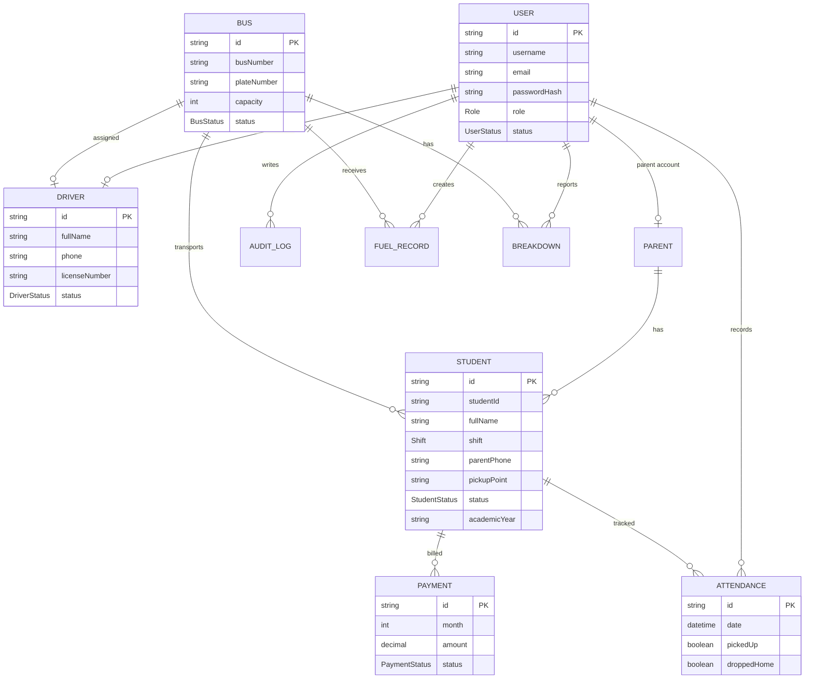

# Buruuj Database ERD

```mermaid
erDiagram
  USER ||--o| DRIVER : "driver account"
  USER ||--o| PARENT : "parent account"
  USER ||--o{ AUDIT_LOG : writes
  USER ||--o{ FUEL_RECORD : creates
  USER ||--o{ BREAKDOWN : reports
  USER ||--o{ ATTENDANCE : records
  PARENT ||--o{ STUDENT : has
  BUS ||--o{ STUDENT : transports
  BUS ||--o| DRIVER : assigned
  BUS ||--o{ FUEL_RECORD : receives
  BUS ||--o{ BREAKDOWN : has
  STUDENT ||--o{ PAYMENT : billed
  STUDENT ||--o{ ATTENDANCE : tracked

  USER {
    string id PK
    string username
    string email
    string passwordHash
    Role role
    UserStatus status
  }
  STUDENT {
    string id PK
    string studentId
    string fullName
    Shift shift
    string parentPhone
    string pickupPoint
    StudentStatus status
    string academicYear
  }
  BUS {
    string id PK
    string busNumber
    string plateNumber
    int capacity
    BusStatus status
  }
  DRIVER {
    string id PK
    string fullName
    string phone
    string licenseNumber
    DriverStatus status
  }
  PAYMENT {
    string id PK
    int month
    decimal amount
    PaymentStatus status
  }
  ATTENDANCE {
    string id PK
    datetime date
    boolean pickedUp
    boolean droppedHome
  }
```
